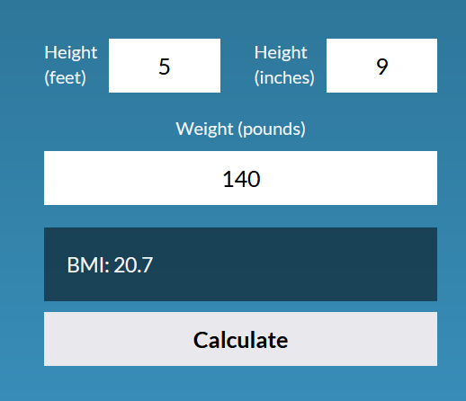

## Body Mass Index (BMI) Calculator
This simple tool is designed to assess your body mass index, a widely-used indicator of body fatness and potential health risks associated with weight. Your BMI is calculated using your height and weight.

In this tutorial, you will see how JavaScript can access user inputs and manipulate them to give desired outputs.

### Built With
<p>
  &nbsp;
  &nbsp;
  &nbsp;
</p>

## Demo
Click [here](https://bernardoyewole.github.io/bmi-calculator/) to open the calculator

A demo is shown below:



## Getting Started
Once the page loads, there are three input fields: ```height (feet)```, ```height (inches)``` and ```weight```. The user enters their height and weight into these fields and clicks on the ```Calculate``` button.

The ```Calculate``` button listens for a ```click``` event and runs some instructions. Check the code below:

```bash
function onEvent(event, selector, callback) {
    return selector.addEventListener(event, callback);
}

onEvent('click', calculate, () => {
    let heightNum = (Number.parseFloat(heightFeet.value) * 12) + Number.parseFloat(heightInches.value);
    let weightNum = Number.parseFloat(weight.value);

    if (isValid(heightNum) && isValid(weightNum)) {
        result.innerText = `${getBmi(heightNum, weightNum).toFixed(1)}`;
    }
});
```
Now, let us check what each part of the code is doing.

```onEvent()``` is an utility function that works exactly like ```document.querySelector()```

```heightFeet.value``` is the input of the user in the ```height (feet)``` field; ```heightInches.value``` is the input of the user in the ```height (inch)``` field; ```weight.value``` is the input of the user in the ```weight``` field.

 These inputs are converted into a number using the ```Number.parseFloat()``` function.

The height in feet value is converted to inches by multiplying by 12. This height is added to the height in inches value entered by the user and stored in the ```heightNum``` variable.

The ```weight.value``` converted to number is stored in the ```weightNum``` variable.

```isValid()``` is a function that checks if the user input is valid. Height and weight values are passed into this function. If the inputs are valid, the ```getBmi()``` function is called and the return value (bmi) is stored in ```result.innerText```. Check both functions below:

```bash
function isValid(arg) {
    if (arg !== '' && !isNaN(Number.parseFloat(arg))) {
        return true;
    }
    else {
        result.innerText = "Enter a valid height and weight";
    }
}

function getBmi(heightnum, weightnum) {
    let bmi = weightnum * 703/ (heightnum * heightnum);
    return bmi;
}
```

```result``` is a class referring to the output field shown below. So, the resulting value of BMI is shown in this field.

